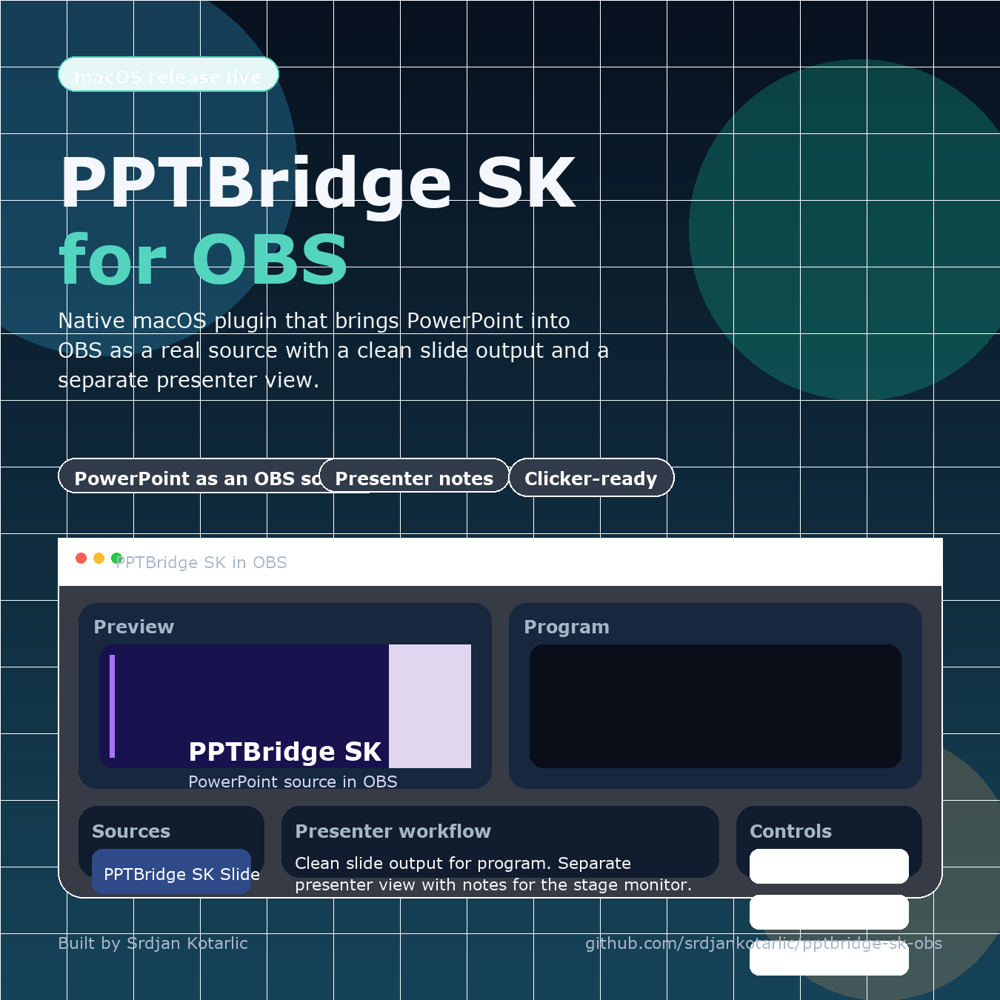

# PPTBridge SK for OBS

**Created by Srdjan Kotarlic**

PPTBridge SK is a native OBS plugin project for PowerPoint workflows in live production.

It adds two real OBS source types:

- `PPTBridge SK Slide`
- `PPTBridge SK Presenter`

The goal is simple:

- send a clean PowerPoint slide feed to program
- keep a separate presenter view with notes on a stage or confidence monitor
- let the speaker move slides with a clicker through OBS hotkeys

## Preview

## What It Does

- loads a `.pptx` directly from OBS source properties
- defaults to true live PowerPoint playback on macOS when Microsoft PowerPoint is installed
- creates a clean slide source for the audience feed
- creates a presenter source with notes, next slide preview, and timer
- supports OBS hotkeys for next, previous, first, last, and black screen
- applies first-run default hotkeys of `2` for next slide and `1` for previous slide
- works with clickers that send keys like `Page Down`, `Page Up`, and arrow keys
- routes PowerPoint slideshow audio into the `PPTBridge SK Slide` source and OBS mixer, with built-in gain trim and dedicated app-audio capture in live mode
- falls back to legacy cached render mode when live PowerPoint mode is unavailable or turned off

## Best Fit

PPTBridge SK is especially useful for:

- conferences
- church livestreams
- corporate presentations
- webinars
- keynote-style event production
- confidence monitor workflows for speakers on stage

## Quick Start

1. Open [native-plugin](native-plugin)
2. Install with the `.pkg` or the current-user `.command` installer
3. Restart OBS
4. Add `PPTBridge SK Slide` to your program scene
5. Add `PPTBridge SK Presenter` to your stage or speaker scene
6. Point both sources to the same `.pptx`
7. Bind `PPTBridge SK` hotkeys in `Settings > Hotkeys`

## Public Release Files

For public sharing and installation:

- `native-plugin/release/PPTBridge-SK-for-OBS-v0.1.1-macOS.zip`
- `native-plugin/dist/PPTBridge-SK-for-OBS-Installer.pkg`
- `native-plugin/release/PPTBridge-SK-Windows-Beta-v0.2.0-beta1-source.zip`
- [PUBLISHING.md](native-plugin/PUBLISHING.md)

## Repo Structure

- [native-plugin](native-plugin) — native plugin source, installers, release scripts, and publish docs
- [SETUP-GUIDE.md](SETUP-GUIDE.md) — end-user setup guide
- [install_deps.sh](install_deps.sh) — developer dependency helper
- [pptbridge_obs.py](pptbridge_obs.py) — legacy Python MVP kept as reference

## Notes

- Current public release is macOS-focused.
- A Windows beta preview source pack is now included under `native-plugin/release`, built for real Windows validation before a stable installer release.
- The Windows beta uses a PowerPoint-driven backend with live slideshow control, slide export fallback, embedded media extraction for fallback playback, presenter rendering, and OBS-side live capture/audio attachment attempts.
- The Windows beta is not yet a one-click installer release. It is a source/beta pack meant to be built and validated on a real Windows OBS machine.
- PDF input is not enabled yet in the Windows beta path.
- In `PPTBridge SK Slide`, true live PowerPoint mode is the preferred path and preserves normal PowerPoint builds, animations, and embedded media behavior much better than cached render mode.
- `PPTBridge SK Presenter` is PPTBridge's own presenter layout, synchronized to the deck and driven by PPTX notes pages plus slide thumbnails.
- Presenter notes appear only when the `.pptx` actually contains notes pages for those slides.
- If live mode is unavailable or disabled, the plugin falls back to cached render mode for compatibility.
- If you need strict OBS control over local PowerPoint audio during a live show, use the virtual routing guide in `native-plugin/PRO-AUDIO-MODE.md`.
- The original Python MVP remains in the repo as reference, but the public product direction is the native `PPTBridge SK for OBS` plugin.
