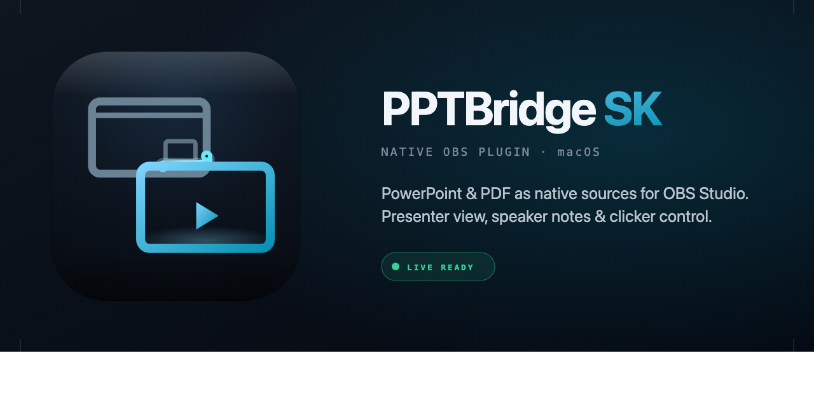

# PPTBridge SK for OBS

**PowerPoint and PDF sources for live productions in OBS.**

Created by [Srdjan Kotarlic](https://github.com/srdjankotarlic).

PPTBridge SK adds two native OBS source types:

- `PPTBridge SK Slide` - clean audience/program output
- `PPTBridge SK Presenter` - speaker view with notes, next slide, and timer

## Download

| Your Mac | Download | Status | Notes |
| --- | --- | --- | --- |
| Apple Silicon Mac | [`pptbridge-obs-macos-apple-silicon.zip`](https://github.com/srdjankotarlic/pptbridge-sk-obs/releases/latest/download/pptbridge-obs-macos-apple-silicon.zip) | Stable | Use this for M1, M2, M3, and M4 Macs |
| Intel Mac | [`pptbridge-obs-macos-intel.zip`](https://github.com/srdjankotarlic/pptbridge-sk-obs/releases/latest/download/pptbridge-obs-macos-intel.zip) | Stable build | Use this for older Macs where `About This Mac` says `Processor: Intel` |

The Apple Silicon and Intel downloads contain the same PPTBridge features. Only the CPU build is different. The current public installer is a ZIP with a one-click command; a signed and notarized `.pkg` installer is tracked for v1.0 in [Issue #1](https://github.com/srdjankotarlic/pptbridge-sk-obs/issues/1).

## Quick Install on macOS

1. Download and unzip the ZIP that matches your Mac.
2. Open `START-HERE-macOS.txt`.
3. Double-click `1-Install-PPTBridge-SK.command`.
4. If OBS is open, let the installer quit it and continue.
5. If macOS blocks the command the first time, right-click it and choose `Open`.
6. Let the installer copy the plugin and open OBS.
7. If OBS asks about Safe Mode, choose normal launch so third-party plugins load.

After OBS opens, add one or both PPTBridge sources from the `Sources` `+` menu.

For a fuller walkthrough, see [native-plugin/INSTALL-macOS.md](native-plugin/INSTALL-macOS.md) and [SETUP-GUIDE.md](SETUP-GUIDE.md).

## What You Add To OBS

| OBS source | Use it for | Typical scene |
| --- | --- | --- |
| `PPTBridge SK Slide` | Clean slide/program output for the audience feed | Program, projector, stream, recording |
| `PPTBridge SK Presenter` | Speaker confidence view with current slide, next slide, timer, and notes | Stage monitor, operator preview, presenter scene |

The presenter source is PPTBridge's own OBS presenter layout. It is not a screen capture of PowerPoint's native Presenter View, so you can size and crop it inside OBS like any other source.

## Basic OBS Workflow

1. Add `PPTBridge SK Slide` to the scene that goes to the audience.
2. Add `PPTBridge SK Presenter` to the scene or monitor view used by the presenter.
3. Select the same `.pptx` or `.pdf` file in both source properties.
4. For `.pptx` live mode, open `PPTBridge SK Slide` properties and click `START - Open PowerPoint / Start Live Mode` in the highlighted `PowerPoint Live Start / Stop` group when you are ready.
5. For PDF decks, PowerPoint is not needed.
6. Control slides with OBS hotkeys, source property buttons, Companion, or local OSC.
7. Customize `PPTBridge SK Presenter` if you want bigger notes, bigger preview, a different split, fit/fill/crop behavior, or confidence-monitor style.

## Multiple PowerPoint Decks

For shows with several decks, make one scene per deck and choose a different `.pptx` in each scene's `PPTBridge SK Slide` and `PPTBridge SK Presenter` sources. Start live mode once per deck from that deck's slide source.

PPTBridge stages each live deck separately and locks PowerPoint commands to that exact staged file, so Deck 2 no longer attaches to Deck 1 just because both are open in PowerPoint. When you change the OBS program scene, hotkeys and local OSC target the PPTBridge source in that scene.

## PowerPoint Startup Options

| Option | What it does | Use it when |
| --- | --- | --- |
| `START - Open PowerPoint / Start Live Mode` | Opens PowerPoint if needed and starts the slideshow only when you click it. It is separated in the highlighted `PowerPoint Live Start / Stop` group. | You want OBS to open quietly and start slides manually |
| `Auto Start PowerPoint When OBS Opens` | Starts the PowerPoint slideshow automatically when OBS loads the source | You want the old automatic behavior |
| `Close PowerPoint Slideshow When OBS Closes` | Closes the slideshow when OBS quits | You want OBS to clean up PowerPoint after the show |
| `STOP - Stop PowerPoint Live Mode` | Stops the running live slideshow from the highlighted `PowerPoint Live Start / Stop` group | You want to end or reset live mode without quitting OBS |
| `PowerPoint Resize Behavior` | Chooses whether OBS ignores or follows PowerPoint window resizing | Keep `Lock OBS Output Size` for live shows; use `Follow PowerPoint Window Size` only when intentional |
| `Lock OBS Size Against PPT Resize` | Forces the OBS source to stay filled even if you shrink the PowerPoint window | You need PowerPoint smaller on the desktop without changing OBS output |
| `Follow Current PPT Window Size` | Lets the OBS output follow the current PowerPoint window shape | You intentionally want the resized PowerPoint window to affect OBS |

Default behavior is manual: OBS can open without immediately popping up the PowerPoint slideshow.
Default resize behavior is locked: you can shrink the PowerPoint slideshow window to see other apps without making the OBS program source smaller.

## Slide Control

- OBS hotkeys default to `2` for next slide and `1` for previous slide.
- PPTBridge only responds to OBS hotkeys while OBS is the active app, so typing in another app will not accidentally move slides.
- For a Logitech Spotlight or other presenter clicker while the operator uses Chrome, OBS, or other apps, enable `Tools > PPTBridge SK: Toggle Spotlight/Clicker Capture`. It captures the same PPTBridge hotkey bindings globally, routes them to the current OBS program scene, and suppresses those captured keys from the focused app.
- Use clicker-style bindings such as PageDown/PageUp or the keys your presenter sends. If you bind normal typing keys such as `1` and `2`, those keys will be swallowed while Spotlight/Clicker Capture is enabled.
- Companion and Stream Deck workflows should use OBS WebSocket or PPTBridge's local OSC listener instead of keyboard presses.
- Local OSC can be enabled in OBS from `Tools > PPTBridge SK: Toggle Local OSC Control` and listens on `127.0.0.1:57130`.
- Useful OSC paths include `/pptbridge/next`, `/pptbridge/previous`, `/pptbridge/first`, `/pptbridge/last`, `/pptbridge/black`, and `/pptbridge/reload`.

## What It Solves

If you have run PowerPoint in a live show, you know the usual pain: full-screen takeover, awkward window capture, no proper confidence monitor, hotkeys that only work when the right app is focused, and fragile audio routing.

PPTBridge SK is built for conference, church, webinar, keynote, and hybrid-event workflows where the audience feed and speaker monitor should be different.

## Key Features

- **Two native OBS sources** for program output and presenter confidence view.
- **PowerPoint and PDF input** on macOS, including multi-page PDFs.
- **Windowed PowerPoint live mode** so PowerPoint does not take over the desktop.
- **Manual or automatic PowerPoint startup** so OBS can open quietly, launch the slideshow on demand, or auto-start it for you.
- **PowerPoint cleanup controls** so the slideshow can close automatically when OBS quits.
- **Automatic title-bar crop** for clean live PowerPoint capture.
- **Presenter notes and next-slide preview** from the original deck.
- **Customizable presenter layouts** with presenter split, preview fit/fill/crop, positioning, notes zoom, and notes sizing.
- **OBS-focused hotkeys** that ignore keyboard input while you work in other apps.
- **Optional Spotlight/Clicker Capture** so a stage clicker can drive only PPTBridge while the operator keeps using Chrome, OBS, or other apps.
- **Local OSC/Companion control** for Stream Deck and show-control workflows without keyboard focus.
- **Multi-deck scene routing** so the current program scene controls the right deck.
- **OBS-side audio capture path** for PowerPoint slideshow media.
- **Cached fallback mode** when live PowerPoint mode is unavailable.
- **Optional slideshow cleanup** when OBS closes.

## Requirements

| Requirement | macOS stable |
| --- | --- |
| macOS | 12 Monterey or newer |
| CPU | Apple Silicon or Intel, using the matching ZIP download |
| OBS Studio | 30 or newer |
| PowerPoint | Microsoft PowerPoint for Mac, required for `.pptx` live mode |
| PDF decks | Supported without PowerPoint |

Apple Silicon was runtime-tested locally on OBS 32.x. Intel is cross-built against the Intel OBS 32.1.1 app with the same feature set and is published for real Intel Mac validation.

## Screenshots

## Release Status

| Release | Status | Use it for |
| --- | --- | --- |
| `v0.4.2` | Stable | Recommended release for most users: stage clicker capture, multi-deck PowerPoint scene routing, locked PowerPoint resize behavior, manual PowerPoint start/stop, Companion/OSC control, and presenter customization |
| [`v0.4.1`](https://github.com/srdjankotarlic/pptbridge-sk-obs/releases/tag/v0.4.1) | Previous stable | Manual PowerPoint start button, optional auto-start, optional close-on-OBS-quit, Companion/OSC control, and presenter customization |
| [`v0.4.0`](https://github.com/srdjankotarlic/pptbridge-sk-obs/releases/tag/v0.4.0) | Previous stable | Companion/OSC control, presenter customization, and safer OBS-focused hotkeys without the v0.4.1 PowerPoint lifecycle controls |
| [`v0.3.0`](https://github.com/srdjankotarlic/pptbridge-sk-obs/releases/tag/v0.3.0) | macOS stable | Presenter customization, safer OBS-focused hotkeys, and confidence monitor polish |
| [`v0.2.2`](https://github.com/srdjankotarlic/pptbridge-sk-obs/releases/tag/v0.2.2) | Previous stable | Apple Silicon + Intel public build with easier installer |
| `v1.0.0` | Planned | Signed/notarized macOS release and wider public launch |

The v1.0 checklist lives in [Issue #1](https://github.com/srdjankotarlic/pptbridge-sk-obs/issues/1).

## Documentation

- [SETUP-GUIDE.md](SETUP-GUIDE.md) - user setup and troubleshooting
- [BUILDING.md](BUILDING.md) - developer build commands and dependencies
- [native-plugin/COMPANION-CONTROL.md](native-plugin/COMPANION-CONTROL.md) - Companion, OBS WebSocket, and local OSC control workflow
- [native-plugin/PRO-AUDIO-MODE.md](native-plugin/PRO-AUDIO-MODE.md) - stricter audio routing setups
- [native-plugin/SIGNING-AND-NOTARIZATION.md](native-plugin/SIGNING-AND-NOTARIZATION.md) - v1.0 signing path

## Repository Structure

| Path | Purpose |
| --- | --- |
| `native-plugin/` | Native OBS plugin source, build scripts, release docs |
| `native-plugin/src/` | Native source implementation |
| `native-plugin/scripts/` | Build, packaging, install, signing helpers |
| `native-plugin/media/github/` | GitHub README/release images |
| `pptbridge_obs.py` | Legacy Python MVP kept only for reference |

## Support and Feedback

- For bugs, open a [Bug report](https://github.com/srdjankotarlic/pptbridge-sk-obs/issues/new?template=bug_report.md).
- For ideas, open a [Feature request](https://github.com/srdjankotarlic/pptbridge-sk-obs/issues/new?template=feature_request.md).
- For v1.0 release progress, follow [Issue #1](https://github.com/srdjankotarlic/pptbridge-sk-obs/issues/1).

When reporting a bug, include your macOS version, Mac type, OBS version, PowerPoint version, deck type (`.pptx` or `.pdf`), and the current OBS log.

## Roadmap

- Companion control via OBS WebSocket and local OSC is available for broadcast control surfaces
- Later video remaining-time support where PPTBridge can reliably read media timing
- Signed and notarized macOS `.pkg` installer
- Second-Mac clean install verification
- macOS v1.0 OBS Forum release
- More real-machine feedback on Intel Macs

## License

The repo root contains the original project license. The native OBS plugin under `native-plugin/` is distributed as GPL-2.0-or-later because it links against OBS Studio components. See [LICENSE](LICENSE) and [native-plugin/LICENSE](native-plugin/LICENSE).

## Credits

Built by [Srdjan Kotarlic](https://github.com/srdjankotarlic) for real live-production work on stage and in broadcast.
