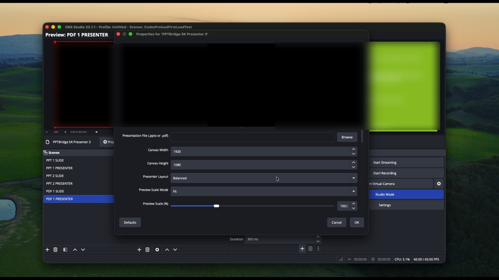

# PPTBridge SK for OBS

**Native OBS sources for PowerPoint and PDF presentations in live productions.**

PPTBridge SK gives OBS two dedicated presentation sources:

- `PPTBridge SK Slide` for the clean audience/program feed
- `PPTBridge SK Presenter` for the speaker view with notes, next slide, and timer

## Demo Video

Watch a short silent demo of PPTBridge SK running inside OBS:
[pptbridge-sk-demo.mov](https://github.com/srdjankotarlic/pptbridge-sk-obs/releases/download/v0.4.7/pptbridge-sk-demo.mov)

## Start Here

| Need | Link |
| --- | --- |
| Install in 5 minutes | [QUICKSTART.md](QUICKSTART.md) |
| Full setup guide | [SETUP-GUIDE.md](SETUP-GUIDE.md) |
| macOS install details | [native-plugin/INSTALL-macOS.md](native-plugin/INSTALL-macOS.md) |
| Windows install details | [native-plugin/INSTALL-Windows.md](native-plugin/INSTALL-Windows.md) |
| Companion / Stream Deck / OSC | [native-plugin/COMPANION-CONTROL.md](native-plugin/COMPANION-CONTROL.md) |
| Windows beta notes | [native-plugin/WINDOWS-BETA-RELEASE.md](native-plugin/WINDOWS-BETA-RELEASE.md) |
| Common questions | [FAQ.md](FAQ.md) |
| Report a problem | [SUPPORT.md](SUPPORT.md) |
| Contribute or test beta builds | [CONTRIBUTING.md](CONTRIBUTING.md) |

## Downloads

| Platform | Download | Status | Use this when |
| --- | --- | --- | --- |
| Apple Silicon Mac | [`pptbridge-obs-macos-apple-silicon.zip`](https://github.com/srdjankotarlic/pptbridge-sk-obs/releases/latest/download/pptbridge-obs-macos-apple-silicon.zip) | Stable | Your Mac has an M1, M2, M3, or M4 chip |
| Intel Mac | [`pptbridge-obs-macos-intel.zip`](https://github.com/srdjankotarlic/pptbridge-sk-obs/releases/download/v0.4.4/pptbridge-obs-macos-intel.zip) | Beta v0.4.4 | Your Mac says `Processor: Intel` in About This Mac |
| Windows 64-bit | [`pptbridge-obs-windows-x64-v0.5.0-beta.1.zip`](https://github.com/srdjankotarlic/pptbridge-sk-obs/releases/download/v0.5.0-beta.1/pptbridge-obs-windows-x64-v0.5.0-beta.1.zip) | Beta installer | You want to test PowerPoint live mode on Windows OBS |

Apple Silicon is the main stable build. Intel Mac and Windows are clearly marked as beta paths while real-hardware feedback is collected.

## What It Solves

PowerPoint is awkward in live production: full-screen takeover, fragile window capture, presenter notes in the wrong place, keyboard focus problems, and difficult media audio routing.

PPTBridge SK keeps the audience feed and speaker view separate inside OBS:

- clean slide output for projector, stream, recording, or switcher
- presenter confidence view with current slide, next slide, notes, and timer
- manual or automatic PowerPoint live startup
- OBS-safe slide control through hotkeys, source buttons, Companion, OSC, or a stage clicker
- multi-deck scene routing for shows with several presentations
- optional PowerPoint slideshow cleanup when OBS closes

## Quick macOS Install

1. Download the ZIP for your Mac from the table above.
2. Unzip it.
3. Open `START-HERE-macOS.txt`.
4. Double-click `1-Install-PPTBridge-SK.command`.
5. If macOS blocks the command, right-click it and choose `Open`.
6. Let the installer copy the plugin and open OBS.
7. In OBS, choose normal launch if Safe Mode appears.

After OBS opens, click `+` in `Sources` and add:

- `PPTBridge SK Slide`
- `PPTBridge SK Presenter`

## Basic OBS Workflow

1. Add `PPTBridge SK Slide` to the scene that goes to the audience.
2. Add `PPTBridge SK Presenter` to the stage monitor or operator preview scene.
3. Select the same `.pptx` or `.pdf` file in both source properties.
4. For `.pptx` live mode, open `PPTBridge SK Slide` properties and click `START - Open PowerPoint / Start Live Mode`.
5. Control slides from OBS hotkeys, the source property buttons, Companion, local OSC, or Spotlight/Clicker Capture.
6. Resize and position the OBS sources like normal OBS sources.
7. Keep live animations and embedded video in `PPTBridge SK Slide`; `PPTBridge SK Presenter` stays a lightweight notes, next-slide, and timer monitor.

For PDF decks, PowerPoint is not required on macOS. For `.pptx` live mode, install Microsoft PowerPoint.

## OBS Sources

| OBS source | What it shows | Best use |
| --- | --- | --- |
| `PPTBridge SK Slide` | The audience slide output | Program scene, projector, stream, recording |
| `PPTBridge SK Presenter` | Current slide, next slide, timer, and notes | Speaker monitor, confidence monitor, operator preview |

The presenter view is rendered by PPTBridge inside OBS. It is not a screen capture of PowerPoint's Presenter View, so it can be resized, cropped, and customized in OBS.

## PowerPoint Live Controls

`PPTBridge SK Slide` has a highlighted `PowerPoint Live Start / Stop` section in source properties. `PPTBridge SK Presenter` also has the same start/stop buttons for shows where the presenter source should launch or stop live mode for the deck, but animated/video rendering stays in the Slide source.

| Control | What it does |
| --- | --- |
| `START - Open PowerPoint / Start Live Mode` | Opens PowerPoint if needed and starts the live slideshow on demand |
| `STOP - Stop PowerPoint Live Mode` | Stops the live slideshow without quitting OBS |
| `Auto Start PowerPoint When OBS Opens` | Starts the slideshow automatically when OBS loads the source |
| `Close PowerPoint Slideshow When OBS Closes` | Cleans up the slideshow when OBS quits |
| `PowerPoint Resize Behavior` | Keeps OBS locked to its canvas or follows the current PowerPoint window shape |

Presenter live-video preview is intentionally postponed for now. It will only return when it can be verified without adding crash risk to OBS.

Default behavior is safe for production: OBS can open quietly, and PowerPoint starts only when you click `START`.
In PowerPoint live mode, extra next commands on the final slide are ignored so the slideshow stays open in OBS instead of dropping out at the end.

## Slide Control

| Control method | Use it when |
| --- | --- |
| OBS hotkeys | The operator controls slides while OBS is focused |
| Source property buttons | You want quick testing inside OBS |
| Spotlight/Clicker Capture | A presenter clicker should drive PPTBridge while the operator uses another app |
| Companion / Stream Deck | You need a control surface that does not depend on keyboard focus |
| Local OSC | You want direct local show-control messages to `127.0.0.1:57130` |

Default OBS hotkeys are:

- `2` for next slide
- `1` for previous slide

PPTBridge ignores normal OBS hotkey callbacks while OBS is not the active app, so typing in another window will not move slides. If a physical clicker must work globally, use `Tools > PPTBridge SK: Toggle Spotlight/Clicker Capture`. Toggle it off again when those clicker keys should behave normally.

When clicker capture is enabled, PPTBridge captures common presenter remote keys by default:

- `PageDown` or `Right Arrow` for next slide
- `PageUp` or `Left Arrow` for previous slide

It also captures supported custom PPTBridge hotkeys you bind in OBS, but plain typing keys such as letters, numbers, `Space`, `Enter`, `Tab`, and `Backspace` are never captured globally. Captured clicker keys route to the PPTBridge source in the current OBS Program scene and are suppressed from the focused app, so the presenter can change slides while the operator uses Chrome, OBS, or another tool.

Useful OSC paths:

- `/pptbridge/next`
- `/pptbridge/previous`
- `/pptbridge/first`
- `/pptbridge/last`
- `/pptbridge/black`
- `/pptbridge/reload`

## Multiple Decks

For shows with several PowerPoint decks:

1. Create one OBS scene per deck.
2. Add that deck's `PPTBridge SK Slide` source to its scene.
3. Add a matching `PPTBridge SK Presenter` source if needed.
4. Click `START - Open PowerPoint / Start Live Mode` for each deck you want ready.
5. Switch OBS Program scenes during the show.

Hotkeys, local OSC, and clicker capture follow the PPTBridge source in the current OBS Program scene. That lets Deck 1, Deck 2, and Deck 3 stay open without one scene controlling the wrong presentation, while the operator can still prepare other scenes without the stage clicker moving the wrong deck.

## Presenter Customization

`PPTBridge SK Presenter` includes controls for:

- balanced, large-preview, large-notes, compact, and confidence-monitor layouts
- preview fit, fill, crop, scale, and position
- notes font size
- notes zoom
- notes area size
- notes vertical position
- lightweight static current-slide preview for stable confidence-monitor use

This is designed for real stage confidence monitors where the presenter may need larger notes or a larger current-slide preview.

## Requirements

| Requirement | Apple Silicon stable | Intel Mac beta | Windows beta |
| --- | --- | --- | --- |
| OS | macOS 12 Monterey or newer | macOS 12 Monterey or newer | Windows 10/11 64-bit |
| OBS | OBS Studio 30 or newer | OBS Studio 30 or newer | OBS Studio 30 or newer |
| CPU | M1, M2, M3, or M4 | Intel Mac | x64 |
| PowerPoint | Required for `.pptx` live mode | Required for `.pptx` live mode | Required for Windows PowerPoint live mode |
| PDF decks | Supported without PowerPoint | Supported without PowerPoint | Not enabled in Windows beta yet |

Apple Silicon has been runtime-tested locally on OBS 32.x. Intel is cross-built with the same feature set and published as a beta download for real Intel Mac feedback. Windows is published as a beta installer ZIP for PowerPoint live-mode testing on OBS 30+.

## Screenshots

## Release Status

| Release | Status | Use it for |
| --- | --- | --- |
| [`v0.4.7`](https://github.com/srdjankotarlic/pptbridge-sk-obs/releases/tag/v0.4.7) | Apple Silicon stable | Recommended Apple Silicon release with faster presenter preparation after live start and final-slide live-mode protection |
| [`v0.4.6`](https://github.com/srdjankotarlic/pptbridge-sk-obs/releases/tag/v0.4.6) | Previous stable | Live PowerPoint control stability, safer process handling, and cleaner release packaging |
| [`v0.4.5`](https://github.com/srdjankotarlic/pptbridge-sk-obs/releases/tag/v0.4.5) | Previous stable | Conservative presenter stability, clearer live controls, and updated docs |
| [`v0.4.4`](https://github.com/srdjankotarlic/pptbridge-sk-obs/releases/tag/v0.4.4) | Apple Silicon stable, Intel beta | Previous macOS release and current Intel beta |
| [`v0.5.0-beta.1`](https://github.com/srdjankotarlic/pptbridge-sk-obs/releases/tag/v0.5.0-beta.1) | Windows beta installer | Windows PowerPoint live-mode testing |
| [`v0.4.3`](https://github.com/srdjankotarlic/pptbridge-sk-obs/releases/tag/v0.4.3) | Previous stable | Default presenter clicker capture |
| [`v0.4.2`](https://github.com/srdjankotarlic/pptbridge-sk-obs/releases/tag/v0.4.2) | Previous stable | Spotlight/Clicker Capture and manual PowerPoint lifecycle controls |
| [`v0.4.1`](https://github.com/srdjankotarlic/pptbridge-sk-obs/releases/tag/v0.4.1) | Previous stable | Manual PowerPoint lifecycle controls |
| [`v0.4.0`](https://github.com/srdjankotarlic/pptbridge-sk-obs/releases/tag/v0.4.0) | Previous stable | Companion/OSC and presenter customization |
| [`v0.3.0`](https://github.com/srdjankotarlic/pptbridge-sk-obs/releases/tag/v0.3.0) | Previous stable | Presenter customization and confidence monitor polish |
| [`v0.2.2`](https://github.com/srdjankotarlic/pptbridge-sk-obs/releases/tag/v0.2.2) | Previous stable | Apple Silicon and Intel public build |

## Documentation

- [QUICKSTART.md](QUICKSTART.md) - shortest path from download to first deck
- [SETUP-GUIDE.md](SETUP-GUIDE.md) - full user setup and troubleshooting
- [FAQ.md](FAQ.md) - common questions and recommended settings
- [SUPPORT.md](SUPPORT.md) - what to include when asking for help
- [CONTRIBUTING.md](CONTRIBUTING.md) - contribution and beta testing expectations
- [BUILDING.md](BUILDING.md) - developer build commands
- [native-plugin/INSTALL-macOS.md](native-plugin/INSTALL-macOS.md) - macOS installation details
- [native-plugin/INSTALL-Windows.md](native-plugin/INSTALL-Windows.md) - Windows installation details
- [native-plugin/COMPANION-CONTROL.md](native-plugin/COMPANION-CONTROL.md) - Companion, OBS WebSocket, and local OSC
- [native-plugin/WINDOWS-BETA-RELEASE.md](native-plugin/WINDOWS-BETA-RELEASE.md) - Windows beta scope and limits
- [native-plugin/WINDOWS-ALPHA-TESTING.md](native-plugin/WINDOWS-ALPHA-TESTING.md) - Windows runtime validation checklist
- [native-plugin/PRO-AUDIO-MODE.md](native-plugin/PRO-AUDIO-MODE.md) - stricter audio routing setups

## Repository Structure

| Path | Purpose |
| --- | --- |
| `native-plugin/` | Native OBS plugin source, build scripts, release docs, media, and packaging helpers |
| `native-plugin/src/` | C++, Objective-C++, and Windows backend source |
| `native-plugin/scripts/` | Build, packaging, install, OSC, signing, and cleanup helpers |
| `native-plugin/media/github/` | GitHub README and release images |
| `pptbridge_obs.py` | Legacy Python MVP kept only for historical reference |

## Support

Use [SUPPORT.md](SUPPORT.md) before opening an issue. The most useful bug report includes:

- macOS or Windows version
- Mac type or Windows CPU
- OBS version
- PPTBridge release
- PowerPoint version
- deck type, such as `.pptx`, `.ppt`, or `.pdf`
- OBS log from `Help > Log Files > View Current Log`

## Buy Me a Coffee

PPTBridge SK is free, open source, and built around real shows I run myself — conferences, church streams, webinars, and stage events. If the plugin saved your night, made the operator's job easier, or helped a speaker look great on camera, you can say thanks on Patreon. No pressure, completely optional.

| If you'd like to chip in | Link |
| --- | --- |
| Buy me a coffee ($10) | [patreon.com/posts/coffee-158046733](https://www.patreon.com/posts/coffee-158046733) |
| Support the gear fund ($100) | [patreon.com/SrdjanKotarlic](https://www.patreon.com/SrdjanKotarlic) |
| Just browse what's on the page | [patreon.com/SrdjanKotarlic](https://www.patreon.com/SrdjanKotarlic) |

Coffee tips go into more testing time, more docs, real-hardware validation on Intel Macs and Windows, and the signed/notarized macOS installer that should come next for wider public use. The plugin itself stays free for everyone — supporters or not. If you can't chip in, a star on the repo or telling one fellow AV operator about PPTBridge SK helps just as much.

Thanks for using it. It genuinely means a lot.

## Roadmap

- Signed and notarized macOS installer before the next broad public push
- OBS Forums / obsproject.com resource listing with screenshots and a short demo
- More real Intel Mac validation
- More Windows live-production validation
- Signed Windows installer after beta validation
- Companion/OSC status feedback
- Video remaining-time support where PowerPoint/media state can be read reliably

## License

The repo root contains the original project license. The native OBS plugin under `native-plugin/` is distributed as GPL-2.0-or-later because it links against OBS Studio components. See [LICENSE](LICENSE) and [native-plugin/LICENSE](native-plugin/LICENSE).

## Credits

Built by [Srdjan Kotarlic](https://github.com/srdjankotarlic) for real live-production work on stage and in broadcast.
